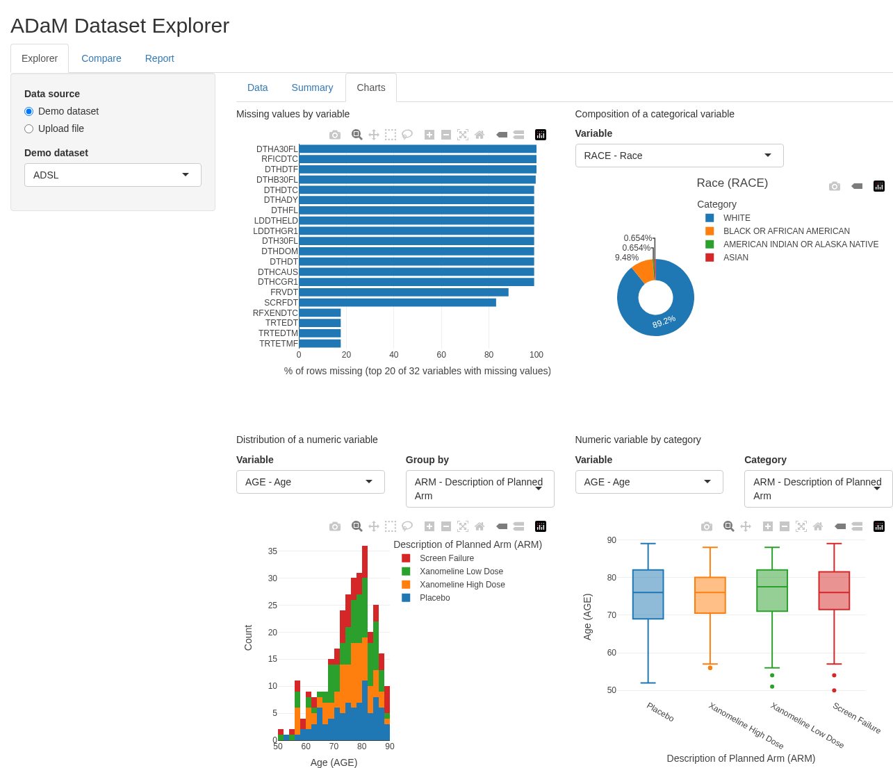

# ADaM Dataset Explorer

A small R Shiny app for exploring and reviewing
[CDISC ADaM](https://www.cdisc.org/standards/foundational/adam) clinical trial
datasets. It is a portfolio project that demonstrates clean, tested,
idiomatic golem/Shiny engineering, not a production tool.




## What it does

1. **Explorer** - load a demo dataset (ADSL or ADAE from
   [pharmaverseadam](https://pharmaverse.github.io/pharmaverseadam/)) or upload
   an XPT/CSV file, then explore it in three tabs:
   - **Data** - a "Data Preview" with a one-line overview (rows, columns, %
     missing cells) and a filterable table. The (i) button next to the header
     opens a searchable pop-up with every variable's name, label and type.
   - **Summary** - one table per type of variable, so no table has empty
     columns: numeric (n, missing, mean, sd, median, min, max), categorical
     (n, missing, distinct, most frequent value with its count and %) and date
     (n, missing, earliest, latest). Only the tables that apply to the
     loaded data are shown.
   - **Charts** - four interactive plotly charts: missing values by variable,
     the composition of a categorical variable (donut), the distribution of a
     numeric variable (histogram, optionally grouped) and a numeric variable by
     category (box plot). The pickers follow whichever dataset is loaded, and a
     chart with nothing to show displays a short message.
2. **Compare** - upload two datasets and run `diffdf::diffdf()`. Differences
   are shown as one row per issue (value differences, columns or rows in only
   one dataset, row-count differences, type mismatches), or as an explicit
   "identical" result.

The R package is named `adamreview` (R package names cannot contain hyphens);
"ADaM Dataset Explorer" is the user-facing name.

## Running the app

Requirements: R 4.4 or newer.

```r
# Restore the locked package versions
renv::restore()

# Run the app from the source checkout
golem::run_dev()          # or: dev/run_dev.R
# or
devtools::load_all(); run_app()
```

## Try it with the sample data

`inst/extdata/sample-data/` holds small, fully synthetic (fictional) datasets
as both CSV and XPT (only the XPT files carry variable labels). Use them with
the **Upload file** option of the Explorer and with the Compare tab:

| Try this | To see |
|---|---|
| Explorer: upload `adsl_sample.xpt` (or `.csv`) | A 60-subject ADSL: Data preview, a numeric/categorical/date summary, and charts of `ARM`, `SEX`, `AGE`, `WEIGHTBL`. |
| Explorer: upload `adae_sample.xpt` | Adverse events linked to ADSL by `USUBJID`, with severity, seriousness and causality to chart. |
| Compare: base `adsl_sample.xpt`, compare `adsl_sample_v2.xpt` | Every kind of difference: changed values, a dropped column (`HEIGHTBL`), an added column (`RANDFL`), 3 removed rows and a type change (`WEIGHTBL`). |
| Compare: `adsl_sample.xpt` vs `adsl_sample_copy.xpt` | The "No differences found" result. |
| Compare: `adae_sample.xpt` vs `adae_sample_v2.xpt` | Changed values, a renamed column (`AEREL` / `AERELAT`) and 4 extra rows in the compare dataset. |
| Compare: `adsl_sample.xpt` vs `adsl_sample_rounded.xpt` | Rounded `WEIGHTBL` and `BMIBL` are reported; a 1e-10 nudge to `HEIGHTBL` is not, because it is within diffdf's tolerance. |
| Compare: `adsl_sample.xpt` vs `adsl_sample_sorted.xpt` | Same subjects in a different order: rows are matched by position, so almost every column differs. Sort both datasets the same way first. |
| Explorer: upload `edge_cases.xpt` | An all-missing column, empty strings, a constant column, a high-cardinality ID, negatives, very long text and a date column, and how the summaries and charts cope. |

The files are generated with a fixed seed by `data-raw/make_sample_data.R`
(`Rscript data-raw/make_sample_data.R` from the package root, needs `haven`);
see `inst/extdata/sample-data/README.md` for one line per file.

## Project layout

| Path | Purpose |
|---|---|
| `R/fct_*.R` | Plain, unit-testable functions that do the work: loading, summarising, chart building, comparing. |
| `R/mod_*.R` | Shiny modules that only wire UI to those functions. |
| `R/app_server.R` | Module wiring only: calls the Explorer and Compare modules. |
| `inst/extdata/sample-data/` | Synthetic sample datasets (CSV and XPT) and their README. |
| `data-raw/make_sample_data.R` | Script that generates the sample datasets. |
| `REQUIREMENTS.md`, `TESTS.md` | Numbered requirements and the test that covers each one. |

## How it was tested

- **testthat (3rd edition) unit tests** cover every `fct_*` function, including
  edge cases: missing files, unsupported formats, empty and all-missing data,
  each variable type in the summaries, empty charts and high-cardinality
  grouping, identical data, and differing values, columns, rows and types. An
  architecture test checks that `fct_*`/`utils_*` functions take no
  `input`/`output`/`session` and that `app_server()` only calls
  `mod_*_server()` functions.
- **Sample-data tests** check that every shipped file loads through the app's
  loader, that XPT files carry labels, and that `adsl_sample_v2` really differs
  from `adsl_sample` under `compare_datasets()`.
- **Two shinytest2 smoke tests**, one per module (Explorer and Compare),
  each drive the module in a headless Chrome. The Explorer test checks the
  Data preview, the (i) variable pop-up, the per-type Summary tables and that
  all four charts render; the Compare test also runs the shipped sample
  datasets. They are skipped when no Chrome/Chromium is found.
- `TESTS.md` maps every requirement in `REQUIREMENTS.md` to its tests.

Run everything locally with:

```r
devtools::test()
```

GitHub Actions (`.github/workflows/R-CMD-check.yaml`) restores the renv
library, installs Chrome, runs `devtools::test()` and then
`R CMD check` on every push and pull request to `main`.
