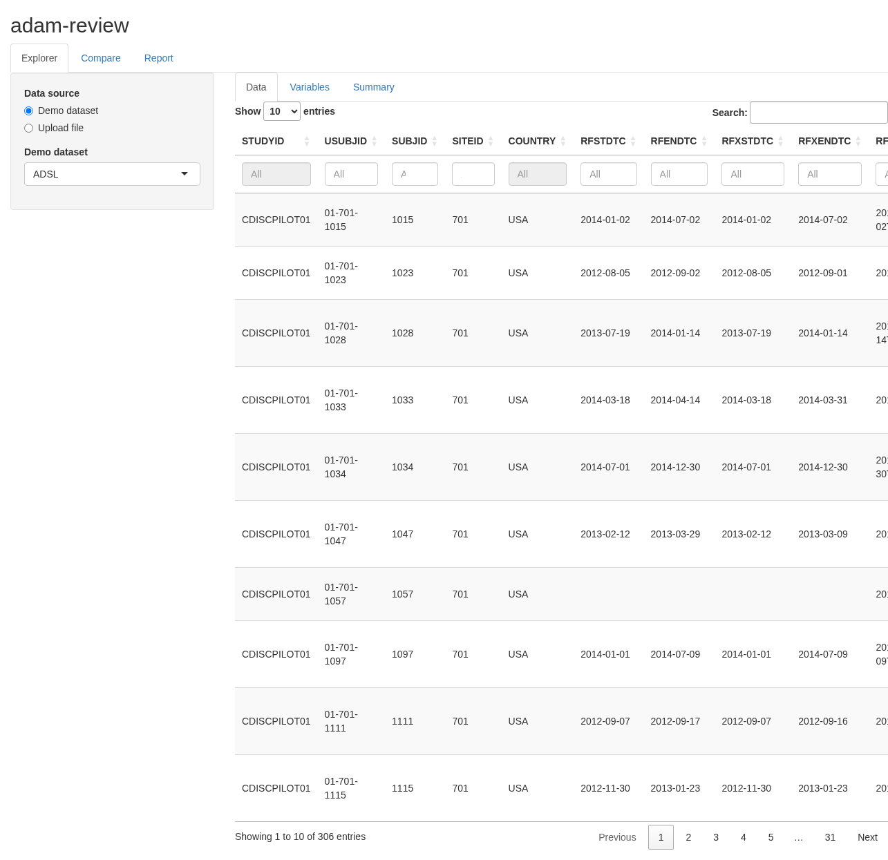

# adam-review

A small R Shiny app for reviewing [CDISC ADaM](https://www.cdisc.org/standards/foundational/adam)
clinical trial datasets. It is a portfolio project that demonstrates clean,
tested, idiomatic golem/Shiny engineering, not a production tool.



## What it does

1. **Explorer** - load a demo dataset (ADSL or ADAE from
   [pharmaverseadam](https://pharmaverse.github.io/pharmaverseadam/)) or upload
   an XPT/CSV file. Browse a filterable table, the variable labels and types,
   and a per-variable summary (n, missing, distinct, numeric statistics, most
   frequent value).
2. **Compare** - upload two datasets and run `diffdf::diffdf()`. Differences
   are shown as one row per issue (value differences, columns or rows in only
   one dataset, row-count differences, type mismatches), or as an explicit
   "identical" result.
3. **Report** - download a self-contained HTML report, rendered from a
   parameterized Quarto template, that combines the Explorer summary and the
   latest Compare result.

The package name is `adamreview` (R package names cannot contain hyphens);
"adam-review" is the human-facing name.

## Running the app

Requirements: R 4.4 or newer. The Report download also needs the
[Quarto CLI](https://quarto.org/docs/get-started/) on your `PATH` (or set
`QUARTO_PATH`).

```r
# Restore the locked package versions
renv::restore()

# Run the app from the source checkout
golem::run_dev()          # or: dev/run_dev.R
# or
devtools::load_all(); run_app()
```

## Project layout

| Path | Purpose |
|---|---|
| `R/fct_*.R` | Plain, unit-testable functions that do the work: loading, summarising, comparing, rendering. |
| `R/mod_*.R` | Shiny modules that only wire UI to those functions. |
| `R/app_server.R` | Module wiring only; passes the Explorer and Compare results to the Report module. |
| `inst/report/report.qmd` | Parameterized Quarto report template. |
| `REQUIREMENTS.md`, `TESTS.md` | Numbered requirements and the test that covers each one. |

## How it was tested

- **testthat (3rd edition) unit tests** cover every `fct_*` function, including
  edge cases: missing files, unsupported formats, empty and all-missing data,
  identical data, and differing values, columns, rows and types. An
  architecture test checks that `fct_*`/`utils_*` functions take no
  `input`/`output`/`session` and that `app_server()` only calls
  `mod_*_server()` functions.
- **Report tests** render the Quarto template for a differing comparison, an
  identical comparison, and an empty session. They are skipped automatically
  when the Quarto CLI is not installed.
- **Three shinytest2 smoke tests**, one per module (Explorer, Compare, Report),
  each drive the module in a headless Chrome. They are skipped when no
  Chrome/Chromium is found.
- `TESTS.md` maps every requirement in `REQUIREMENTS.md` to its tests.

Run everything locally with:

```r
devtools::test()
```

GitHub Actions (`.github/workflows/R-CMD-check.yaml`) restores the renv
library, installs Quarto and Chrome, runs `devtools::test()` and then
`R CMD check` on every push and pull request to `main`.
